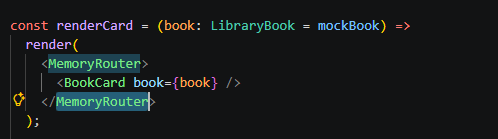
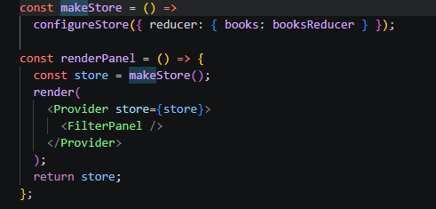
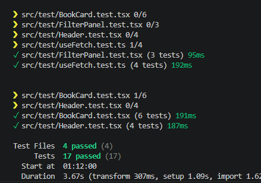
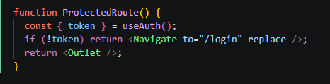
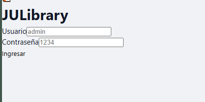

# **Laboratorio 6**

## **Pruebas Unitarias e Integración con Backend y Autenticación**

---

## **Parte 1 — Pruebas Unitarias**

Escribimos pruebas para tres componentes más importantes  y el hook personalizado useFetch usando Vitest, que es compatible con Jest, y React Testing Library. Vitest lo configuramosen el proyecto con entorno jsdom y globals habilitados.

### **BookCard**

Es el componente principal que muestra la información de cada libro. Lo probamos con MemoryRouter por  que  usa Link de React Router. Las pruebas comprueban que el título, autor y año se muestran correctamente, que el badge cambia entre Disponible y Prestado según el estado, aunque esta parte funcionará mockeada por que no sabemos cuando tenemos este estado de cada libro,y si aparece el espacio vacío cuando no hay portada, y que si la imagen falla al cargar ese espacio la reemplaza usando fireEvent.error.

### **Header**

Usa dos contextos, ThemeContext y AuthContext, y React Router. Lo envolvemos con todos sus proveedores al momento de renderizarlo en el test. Probamos que el nombre de la marca y los links de navegación son visibles, que el botón de cambio de tema responde al hacer click, y que el botón de cerrar sesión no aparece cuando no hay sesión activa.

### FilterPanel

Es el componente conectado a Redux. Creamos una versión nueva del store por cada test para asegurarnos de que el estado empiece limpio. Probamos que las categorías se muestran, que al hacer click en una el store actualiza filterCategory, y que el selector de ordenamiento funciona bien.

### **useFetch**

Es el hook que creamos para centralizar las llamadas HTTP. Simulamos globalThis.fetch con vi.spyOn para tener estas respuestas sin hacer peticiones reales. Probamos el estado inicial de carga, que data recibe el valor correcto cuando la respuesta pasa, que error se guarda cuando la respuesta falla, y que si la URL es nula el hook no llama a fetch.

## **Parte 2 — Backend y Autenticación**

Creamos un servidor Express sencillo en backend/index.js con tres rutas: POST /api/login, POST /api/logout y GET /api/me. Los tokens se generan de forma aleatoria con un generador de numeros randomicos y varias funciones que evitan que el codigo se repita y se guardan en un Set en memoria.

El flujo de autenticación que hicimos funciona así:

1. Usuario ingresa sus datos en LoginPage, que hace un POST a /api/login.
2. El servidor los valida y devuelve un token.
3. AuthContext guarda el token en el estado y en localStorage para validaciones.
4. Las rutas principales están protegidas con ProtectedRoute: si no hay token, redirige a /login.
5. El token se envía en el encabezado Authorization al hacer llamadas a rutas protegidas.
6. Al cerrar sesión, AuthContext llama a POST /api/logout para eliminar el token en el servidor, luego lo borra del estado y del localStorage, y redirige a /login.

El botón de cerrar sesión en el Header aparece solo cuando hay un token activo

vista funcional:

cuando ingresamos los usuarios en el array:

## Parte 3:
Se deployo el programa en azure static web apps siguientdo estos pasos 
- Crear el repositorio en github.
- Ingresar con credenciales en alguna cuenta
- En la configuracion de la creacion del servicio seleccionar el repositorio del cual saldra el programa 
- crear la aplicacion.
- revisar el actions de github  para ver si es que hay algun problema en el pipe que creo static apps para deployar la app.
- Entrar en la página deployada:
